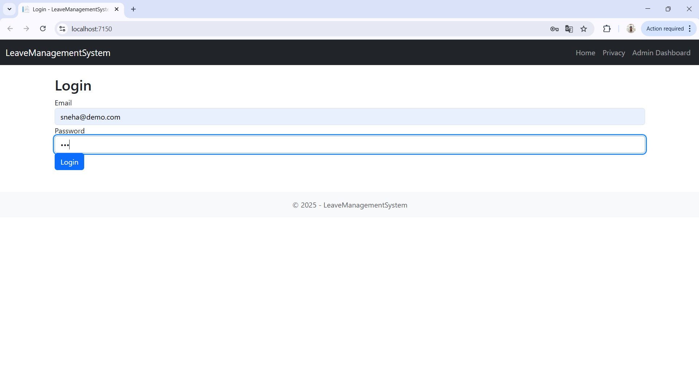
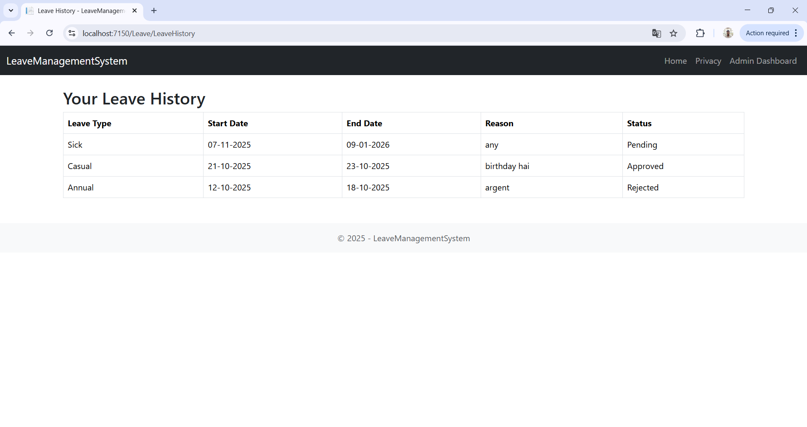
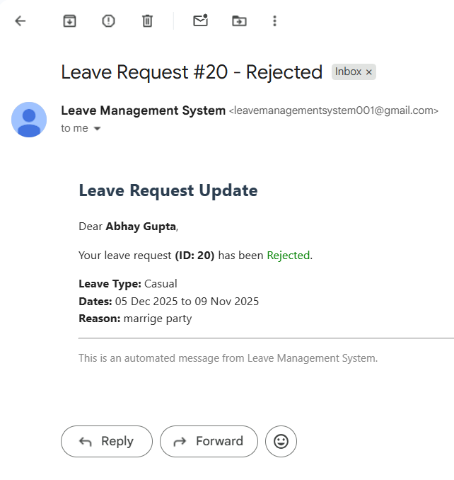
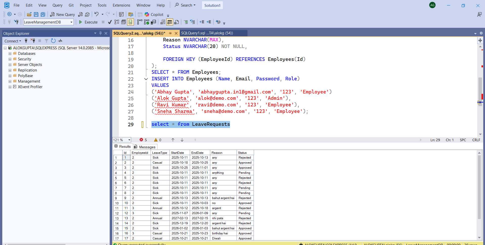

# 🗂️ Employee Leave Management System

A full-stack HR-grade leave management platform built with ASP.NET Core and SQL Server. It supports role-based access, leave request workflows, analytics dashboards, and export features.

---

## 🚀 Features

- 👤 Employee login and leave request submission
- ✅ Admin approval/rejection workflow
- 📊 Dashboard with monthly leave trends (Chart.js)
- 📥 Excel export of leave data
- 📧 Email notifications (optional)
- 🔐 Role-based access control (Admin / Employee)

---

## 🛠️ Tech Stack

| Layer        | Technology                  |
|--------------|-----------------------------|
| Frontend     | Razor Pages, Bootstrap, Chart.js |
| Backend      | ASP.NET Core, ADO.NET       |
| Database     | SQL Server, Stored Procedures |
| Dev Tools    | Visual Studio, SSMS, GitHub |
| Versioning   | Git                         |

---

## 📁 Folder Structure
employee-leave-management/

├── Controllers/ 

├── Models/ 

├── Views/ 

├── sqlserver/

  ├─ create-tables.sql 

  ├─ insert-data.sql

  └─ sample-queries.sql

├── wwwroot/

  ├─ README.md

---

## 📦 SQL Scripts

Located in `/sql`:
- `create-tables.sql`: Creates `LeaveManagementDB` with `Employees` and `LeaveRequests` tables
- `insert-data.sql`: Seeds sample employees and leave requests
- `sample-queries.sql`: Dashboard summaries and admin filters

---

## 📸 Screenshots

> screenshots in `/screenshots` folder and embed here using Markdown:
```markdown
🔐 Employee Login Pages


🧑‍💼 Employee Dashboard


📝 Request Leave


📜 Leave History


🔐 Admin Login Pages


🛡️ Admin Dashboard


🧮 Admin Dashboard Table View


📊 Monthly Leave Trends


📈 Excel Export


📧 Email Notification


🖥️ SQL Server Setup


📚 How to Run
1. Clone the repo
   git clone https://github.com/abhaygupta-dev01/employee-leave-management.git

2. Open in Visual Studio
   .Set up connection string in appsettings.json
   .Run SQL scripts in SSMS

3. Build and run the project
   dotnet run

👨‍💻 Author
- Name: Abhay Gupta
- Email: abhaygupta.dev1@gmail.com
- GitHub: https://github.com/abhaygupta-dev01
- LinkedIn: https://www.linkedin.com/in/abhaygupta-dev

📄 License
   This project is open-source under the MIT License


