# 🗂️ Employee Leave Management System

A full-stack HR-grade leave management platform built with ASP.NET Core and SQL Server. It supports role-based access, leave request workflows, analytics dashboards, and export features.

---

## 🚀 Features

- 👤 Employee login and leave request submission
- ✅ Admin approval/rejection workflow
- 📊 Dashboard with monthly leave trends (Chart.js)
- 📥 Excel export of leave data
- 📧 Email notifications 
- 🔐 Role-based access control (Admin / Employee)

---

## 🛠️ Tech Stack

| Layer        | Technology                  |
|--------------|-----------------------------|
| Frontend     | Razor Pages, Bootstrap, Chart.js |
| Backend      | ASP.NET Core, ADO.NET       |
| Database     | SQL Server, Stored Procedures |
| Dev Tools    | Visual Studio, SSMS, GitHub |
| Versioning   | Git                         |

---

## 📁 Folder Structure
employee-leave-management/

├── Controllers/ 

├── Models/ 

├── Views/ 

├── sql/

    ├─ create-tables.sql 

    ├─ insert-data.sql

    └─ sample-queries.sql

├── wwwroot/

    ├─ README.md

---

## 📦 SQL Scripts

Located in `/sql`:
- `create-tables.sql`: Creates `LeaveManagementDB` with `Employees` and `LeaveRequests` tables
- `insert-data.sql`: Seeds sample employees and leave requests
- `sample-queries.sql`: Dashboard summaries and admin filters

---

## 📸 Screenshots

> screenshots in `/screenshots` folder and embed here using Markdown:

🔐 Employee Login Pages

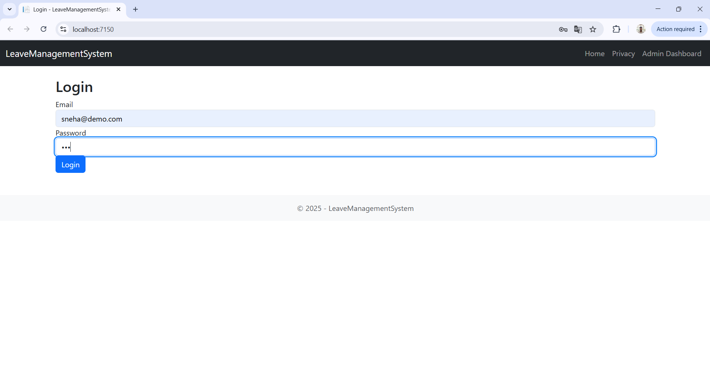

🧑‍💼 Employee Dashboard

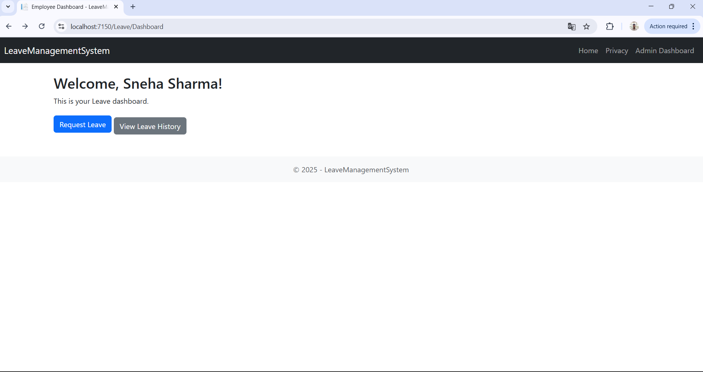

📝 Request Leave

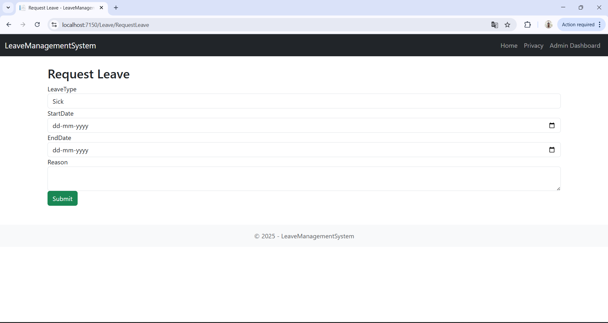

📜 Leave History

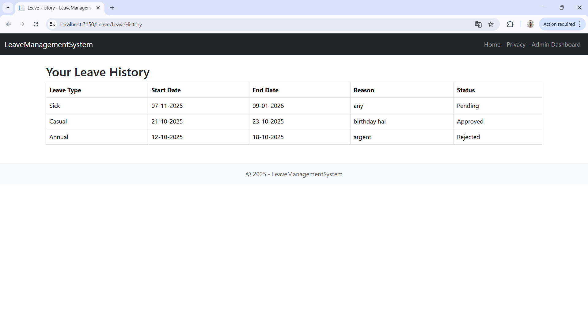

🔐 Admin Login Pages

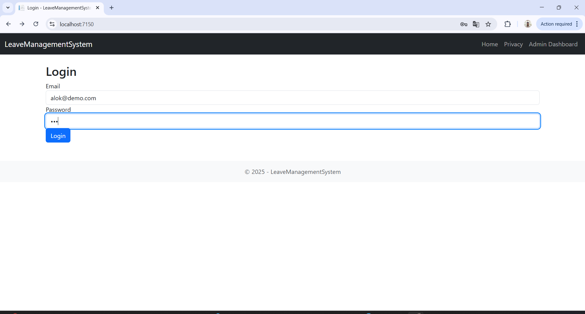

🛡️ Admin Dashboard

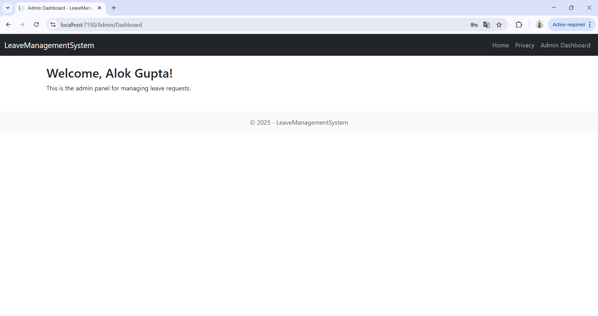

🧮 Admin Dashboard Table View

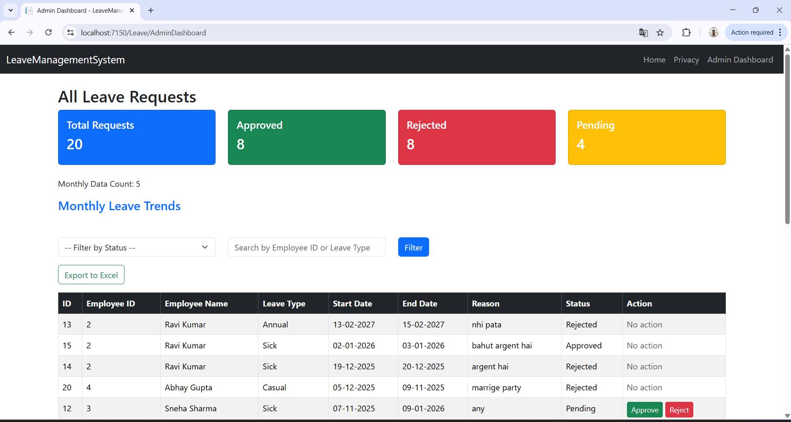

📊 Monthly Leave Trends

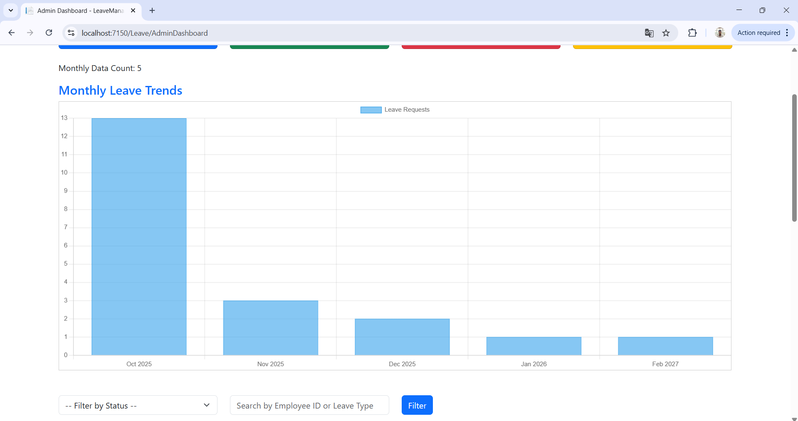

📈 Excel Export

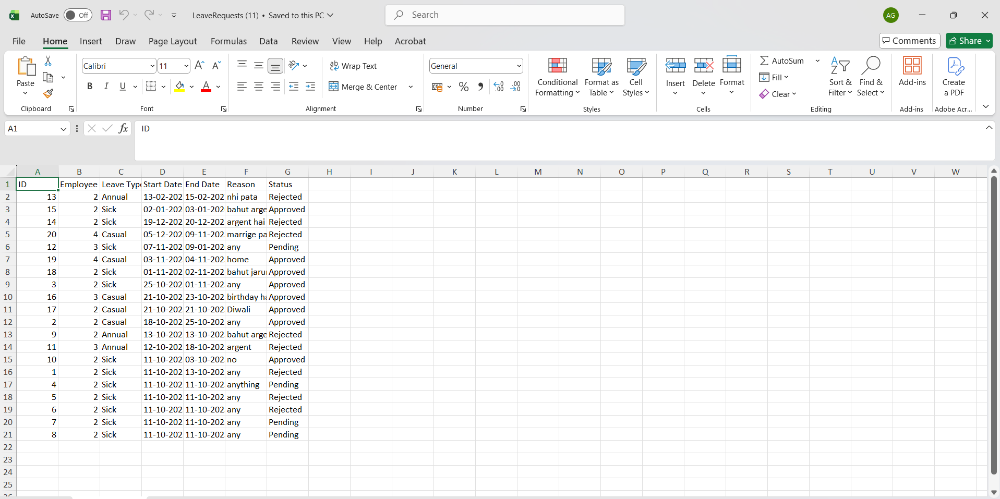
📧 Email Notification

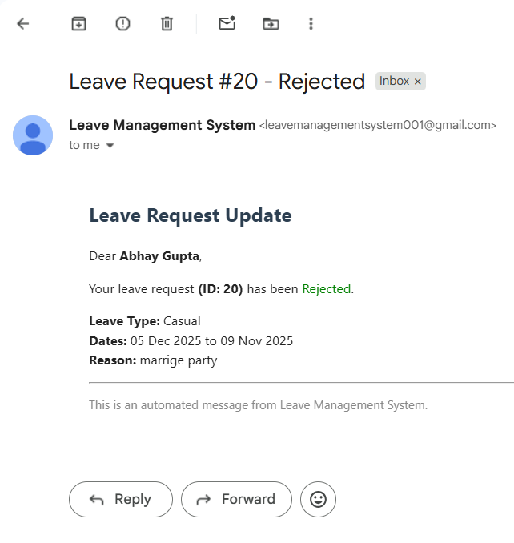

🖥️ SQL Server Setup

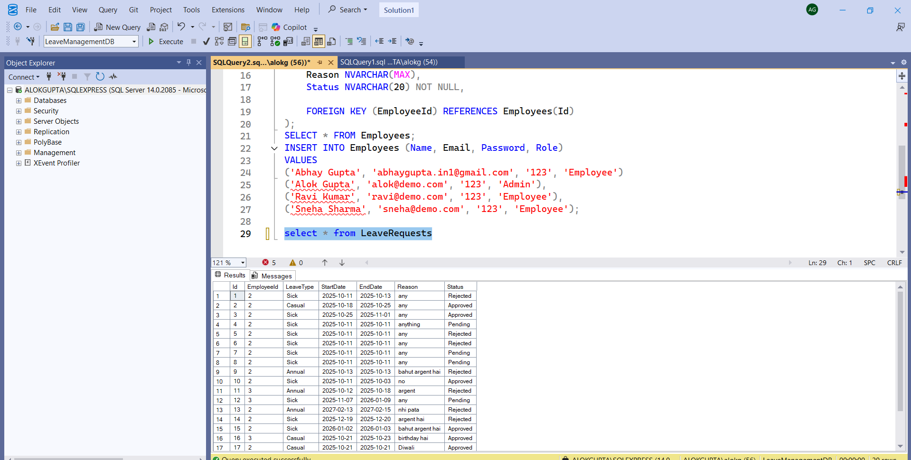

---

## 📚 How to Run Locally

1. **Clone the repo**
   ```bash
   git clone https://github.com/abhaygupta-dev01/employee-leave-management.git
   ```

2. **Open in Visual Studio**
   - Set up connection string in `appsettings.json`
   - Run SQL scripts in SSMS

3. **Build and run the project**
   ```powershell
   dotnet run
   ```

---

## 🚀 Free Deployment

This project is ready for free deployment! See **[DEPLOYMENT.md](DEPLOYMENT.md)** for detailed instructions.

### Quick Deploy Options:

1. **Railway** (Recommended) - [railway.app](https://railway.app)
   - Free $5 credit/month
   - Auto-deploys from GitHub
   - Free PostgreSQL included

2. **Render** - [render.com](https://render.com)
   - 750 free hours/month
   - Free PostgreSQL available

3. **Azure App Service** - [portal.azure.com](https://portal.azure.com)
   - Free F1 tier available
   - Free Azure SQL for 12 months

4. **Fly.io** - [fly.io](https://fly.io)
   - 3 free VMs
   - Great for Docker deployments

### Deployment Files Included:
- ✅ `Dockerfile` - For containerized deployment
- ✅ `.dockerignore` - Optimized Docker builds
- ✅ `DEPLOYMENT.md` - Complete deployment guide
- ✅ `QUICK_START.md` - Step-by-step deployment guide
- ✅ `ENVIRONMENT_VARIABLES.md` - Environment variable setup

### Quick Start Deployment:
See **[QUICK_START.md](QUICK_START.md)** for a 5-minute deployment guide.

---

## ⚙️ Configuration

### Environment Variables (for production):

```
ConnectionStrings__DefaultConnection=<your-database-connection>
EmailSettings__SmtpServer=smtp.gmail.com
EmailSettings__Port=587
EmailSettings__SenderEmail=your-email@gmail.com
EmailSettings__SenderPassword=your-app-password
EmailSettings__SenderName=Leave Management System
```

For detailed environment variable setup, see **[ENVIRONMENT_VARIABLES.md](ENVIRONMENT_VARIABLES.md)**.

---

## 👨‍💻 Author

- **Name:** Abhay Gupta
- **Email:** abhaygupta.dev1@gmail.com
- **GitHub:** https://github.com/abhaygupta-dev01
- **LinkedIn:** https://www.linkedin.com/in/abhaygupta-dev

---

## 📄 License

This project is open-source under the MIT License

---

## 🆘 Support

For deployment help, see [DEPLOYMENT.md](DEPLOYMENT.md) or check the hosting platform's documentation.
